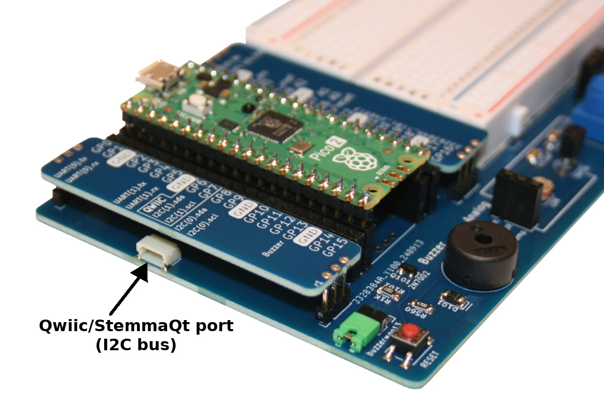
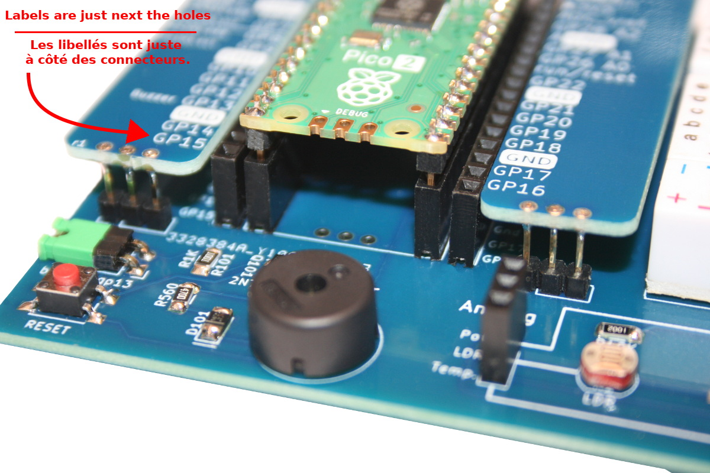
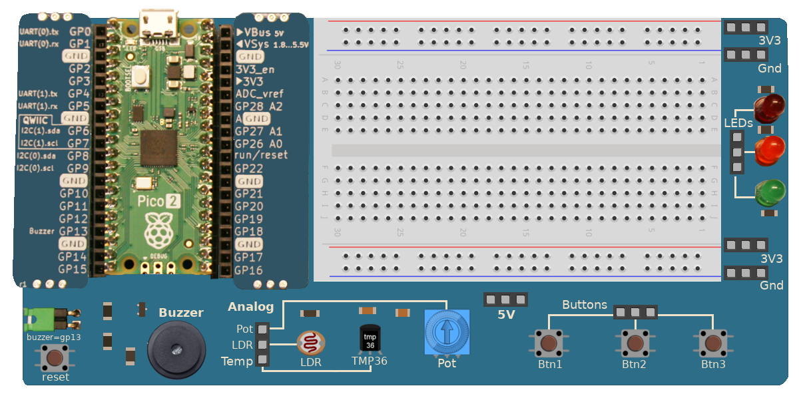

[This file also exists in English](readme_ENG.md)

# Pico-2-Explorer : découvrir la programmation MicroPython avec Raspberry-Pi Pico
Le Pico 2 Explorer est un [produit créé par shop.mchobby.be](https://shop.mchobby.be/fr/pico-rp2x/2718-pico2-base-decouverte-et-exploration-de-l-electronique-avec-micropython-3232100027183.html) comme un laboratoire d'expérimentation pour découvrir les fondamentaux de la programmation électronique. 

Comme tout laboratoire qui se respecte, cet outil est réutilisable! Tout utilisateur averti sait qu'il est utile d'avoir à portée de main des LED et des boutons. Un potentiomètre peut servir de consigne et, enfin, le buzzer sera un excellent outil d'alerte.

ThiCe laboratoire est conçu autour de MicroPython et les éléments sont pré-câblés pour faciliter les premières expériences électroniques avec Pico 2 et MicroPython ( [Python pour Microcontrolleur](https://micropython.org) )

## Fonctionnalités intéressante
Ce laboratoire propose des fonctionnalités intéressantes:

Le connecteur Qwiic/StemmaQt est très pratique pour brancher des capteurs exploitant la même connectique. Notre [dépôt esp8266-upy](https://github.com/mchobby/esp8266-upy) propose des pilotes pour de nombreux capteurs.

 
Les libellés des broches du pico sont mentionnés juste à côté des trous du connecteur. Cela permet d'éliminer les problèmes de parallaxe et de positionnement lorsqu'il faut connecter un fil de prototypage.

Pour finir, chaque composant est utilisable en branchant ___un seul fil supplémentaire___ (la masse commune est déjà pré-cablé sur la carte)! Voyez not [tutoriels Pico-2-Explorer](https://wiki.mchobby.be/index.php?title=Pico-2-Explorer-FR) sur le Wiki de MCHobby.

# Créer vos propres raccordements
Le dépôt contient également le [graphique de la carte Pico-2-Explorer](docs/_static/Pico-2-Explorer-drawing.png). Utilisez votre logiciel graphique favori pour réaliser le diagramme de raccordement de vos propres projets. 

# Ressources
*  [Pico 2 Explorer](https://shop.mchobby.be/fr/pico-rp2x/2718-pico2-base-decouverte-et-exploration-de-l-electronique-avec-micropython-3232100027183.html) @ MCHobby
* [tutoriels du Pico-2-Explorer](https://wiki.mchobby.be/index.php?title=Pico-2-Explorer-FR)
* [Ressources du dépôt Pico-2-Explorer](https://github.com/mchobby/pico-2-explorer/)