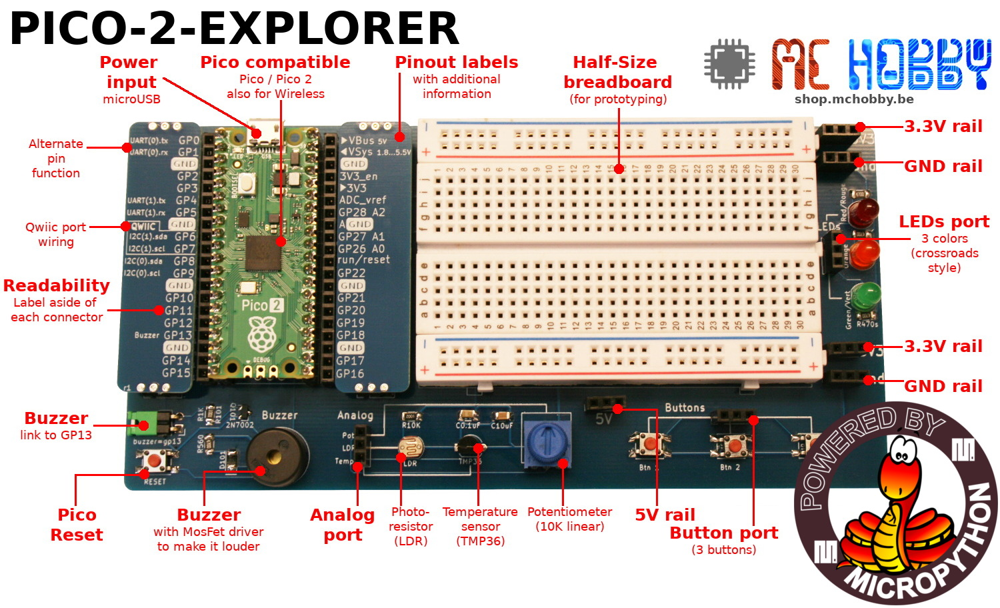
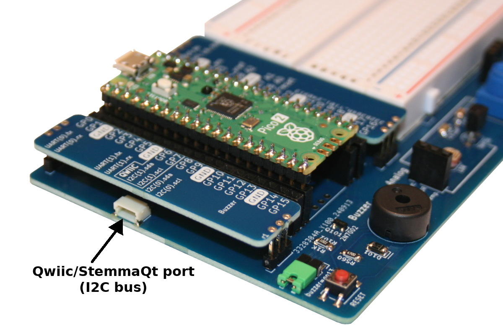
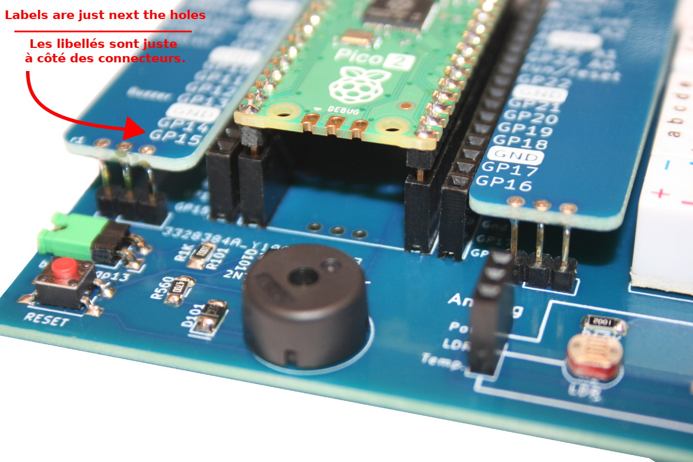
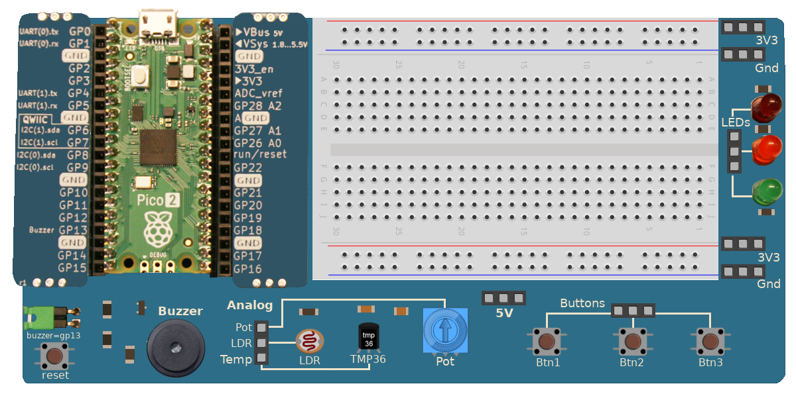

[Ce fichier existe également en FRANCAIS](readme.md)

# Pico-2-Explorer : discover MicrPython programming with Raspberry-Pi Pico
The Pico 2 Explorer is [product created by shop.mchobby.be](https://shop.mchobby.be/fr/pico-rp2x/2718-pico2-base-decouverte-et-exploration-de-l-electronique-avec-micropython-3232100027183.html) as a laboratory to experiment the fundamental of programming and electronics. 

Like any laboratory worth its salt, the tools are reusable! Any experienced user knows that it is useful to have LEDs and buttons at hand. A potentiometer can be used as a setpoint and, finally, the buzzer will be an excellent alert tool.

This laboratory is designed around MicroPython and involves pre-wired components to facilitate the first electronic experiments with Pico 2 and MicroPython ( [Python for Microcontroler](https://micropython.org) )

## Neat features
This laboratory offers neat features:

The Qwiic/StemmaQt connector will be very handy to connect sensors. Our [esp8266-upy repository](https://github.com/mchobby/esp8266-upy) offers drivers for many sensors.

 
Pin labelling are placed next to the hole avoiding parallax and positionning issue when connecting a prototyping wire.

Finally, all the sensors can be used by connecting only ___one single wire___ (the common ground is already pre-wired)! See our [Pico-2-Explorer tutorials](https://wiki.mchobby.be/index.php?title=Pico-2-Explorer-FR) on the MCHobby's Wiki.

# Create your drawing
This repository includes the [Pico-2-Explorer drawing board](docs/_static/Pico-2-Explorer-drawing.png), just use it with your favorite drawing software to draw the wiring of your own project. 

# Ressources
*  [Pico 2 Explorer](https://shop.mchobby.be/fr/pico-rp2x/2718-pico2-base-decouverte-et-exploration-de-l-electronique-avec-micropython-3232100027183.html) @ MCHobby
* [Pico-2-Explorer tutorials collection](https://wiki.mchobby.be/index.php?title=Pico-2-Explorer-FR)
* [Pico-2-Explorer GitHub ressources](https://github.com/mchobby/pico-2-explorer/)